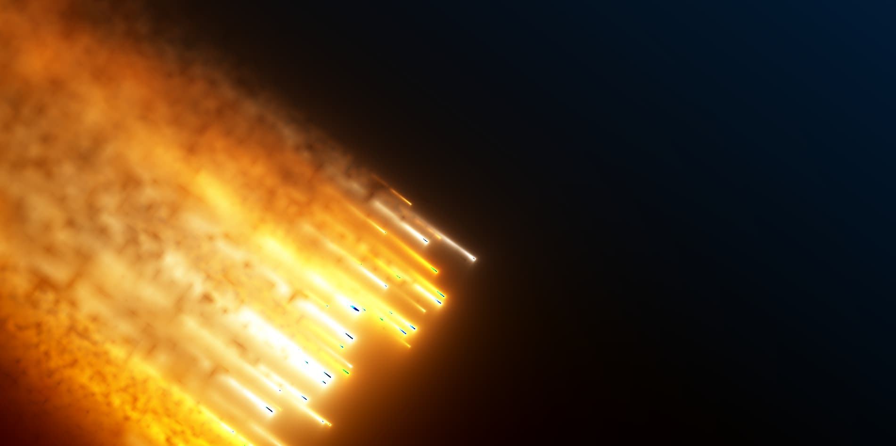

<div>



#  Comets

### *Fifty digital fireflies falling through a sky of code*

<br/>

A GLSL shader that simulates comets with glowing trails,
organic motion, and a depth that invites you to stop and watch.

*Inspired by the debris from SpaceX's 7th Starship test flight.*

<br/>

</div>

---

## What is this?

**Comets** is a single HTML file containing a complete shader: fifty colored particles fall across the screen with trails of light that fade, flicker, and intertwine.

No frameworks. No dependencies. No build tools.

Just a browser, a canvas, and a hundred lines of GLSL doing magic.

The original shader — [*Starship*][shadertoy-url] by **@XorDev** — was built for Shadertoy. This version sets it free, running autonomously with a procedurally generated noise texture and a pure WebGL rendering pipeline.

---

## Features

| | Detail |
|---|---|
| **Particles** | 50 comets with independent positions |
| **Color** | RGB with separate frequencies per channel — red persists, blue dissipates |
| **Brightness** | Exponential fluctuation between *1/e* and *e* per particle |
| **Texture** | Procedural noise generated in Canvas 2D — no external files |
| **Tonemap** | `tanh` for a smooth, controlled dynamic range |
| **Aspect ratio** | Stays stable when resizing the window |
| **Dependencies** | Zero |

---

## Quick start

### Option A — Double click

1. Clone the repository
2. Open `index.html` in any modern browser
3. Done

```bash
git clone https://github.com/sebastianvasquezechavarria1234/comet.git
cd comet
# Open index.html
```

### Option B — Local server

If you prefer running a server (for CORS or any other reason):

```bash
# Python
python -m http.server 3000

# Node.js
npx serve .
```

Then open `http://localhost:3000`.

---

## Structure

```
comet/
├── index.html              ← The project. Open it.
├── comets.glsl             ← Base shader (reference)
├── comets_complete.glsl    ← Variant with external texture
├── img/
│   └── preview.jpg         ← Screenshot
└── README.md               ← What you're reading
```

**`index.html`** is the heart. It contains the WebGL initialization, noise texture generation, and the full shader. Nothing else is needed.

The `.glsl` files exist as reference for anyone who wants to bring the shader into Shadertoy or other editors.

---

## Under the hood

### The journey of a pixel

```
Fragment coordinates
        │
        ▼
   Center + rotation
        │
        ▼
   ┌─── 50-particle loop ───┐
   │                         │
   │  Position (sin + time)  │
   │  Color (RGB by index)   │
   │  Brightness (exponential)│
   │  Trail (falloff + noise) │
   │                         │
   └─────────────────────────┘
        │
        ▼
    Tonemap → Screen
```

### Comet positioning

Each particle has a center calculated with trigonometric functions. The Y component includes a linear time dependency, creating the constant fall:

```glsl
vec3 center = vec3(
    cos(i*11.0 + i*i + T*0.2),
    sin(i*9.0  + i*i + T*0.2) - t*0.5 - i*0.15,
    0.0
);
```

- `i` — particle index (0 to 49)
- `t` — time in seconds
- `T` — time modified with a spatial component

The `- i*0.15` term distributes particles vertically so they don't all appear at the same point.

---

## Tuning

| Parameter | Line | Effect |
|-----------|------|--------|
| Fall speed | `- t*0.5` | Increase to fall faster |
| Vertical spread | `- i*0.15` | Increase for more dispersion |
| Particle count | `n < 50` | More particles = more density |
| Brightness intensity | `exp(sin(...))` | Direct multiplicative factor |

---

## Credits

This project wouldn't exist without the work of **[@XorDev][xordev-url]**, whose *Starship* shader served as foundation and reference.

The visual inspiration comes from [SpaceX's 7th Starship test flight][inspiration-url] — the luminous debris it left in the sky.

---

## License

Distributed under the **MIT** license. Use this code however you want.

---

<div align="center">
Made with ❤️ by <a href="https://sebas-dev.vercel.app/" target="_blank" rel="noopener noreferrer">Sebastián V</a>
</div>

<!-- Badges -->
[webgl-badge]: https://img.shields.io/badge/WebGL-1.0-990000?style=flat-square&logo=webgl&logoColor=white
[webgl-url]: https://www.khronos.org/webgl/
[license-badge]: https://img.shields.io/badge/License-MIT-blue.svg?style=flat-square
[license-url]: https://opensource.org/licenses/MIT
[shadertoy-url]: https://www.shadertoy.com/view/Xs33Dv
[xordev-url]: https://x.com/XorDev
[inspiration-url]: https://x.com/elonmusk/status/1880040599761596689
